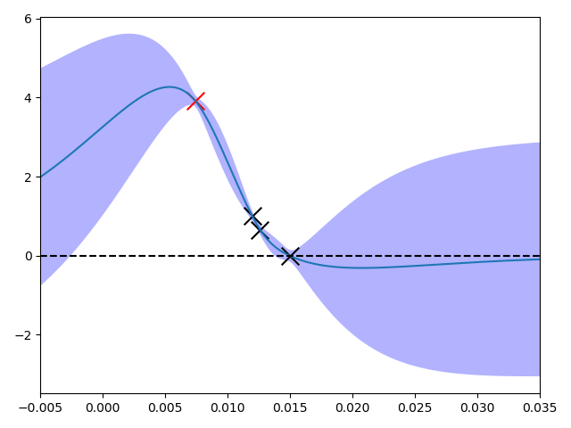

# OpenModelica Microgrid Gym (OMG)


[](https://github.com/upb-lea/gym-electric-motor/blob/master/LICENSE)

__The OpenModelica Microgrid Gym (OMG) package is a software toolbox for the
simulation and optimisation of Microgrids.__ 

The main characteristics of the toolbox are the plug-and-play grid design in OpenModelica and the ready-to-go approach of simply Reinfrocement Learning (RL) agents. 

The is built upon the [OpenAI Gym Environments](https://gym.openai.com/) for reinforcement learning. 
Therefore, the toolbox is specifically designed for running reinforcement 
learning algorithms to train agents controlling the Microgrids.

Read the [User Guide](docs/user_guide/user_guide.md)

[Read the detailed docs!](https://git.uni-paderborn.de/walli/reinforcement-learning-microgrid)


## Installation

#####Install Python environment
- Install OpenModelica MicrogridGym from PyPI (recommended):

```
pip install openmodelica_microgrid_gym
```

- Or install from Github source:

```
git clone TODO: XXXXXXXXXXXXXXXXXXXXXXXXXXXXXX 
cd gym-electric-motor
# Then either
python setup.py install
# or alternatively
pip install -e .
```

#####Installation of OpenModelica

OMG was create by using v1.17, but in general, it is recommended to use the [nightly build](https://openmodelica.org/developersresources/nightly-builds). 

##Getting started


OMG uses the [FMI standard](https://fmi-standard.org/) for the exchange of the model between OpenModelica and python.

An example network consisting out of two inverters, three filters and an inductive load.


You can either use one of the provided FMUs (Windows and Linux, 64-bit, both included in the grid.network.fmu) or create your own by running: 


```
path\reinforcement_learning_microgrid\reinforcement_learning_microgrid\fmu> omc create_fmu.mos
```

A save bayseian approach of a Reinforcement Learning agent is provided under examples/berkamkamp.py.



Running the main.py starts a simulation with a manually tuned cascaded PIPI controller


Every user defined settings can be directly done in the example program. 

* `env = gem.make(environment-id, **kwargs)`  
    Returns an instantiated grid environment. Provide any additional settings right here (see full documentation for all possibilities)

 

### Running Tests with Pytest
To run the tests ''pytest'' is required.
All tests can be found in the ''tests'' folder.
Execute pytest in the project's root folder:
```
>>> pytest
```
or with test coverage:
```
>>> pytest --cov=./
```
All tests shall pass.

### Citation
A whitepaper for this framework is available under [arxiv.org/XXXX
](https://arxiv.org/XXXX). Please use the following BibTeX entry for citing us:
```
@misc{LEA2020reinforcementMG,
    title={Towards a Reinforcement Learning Environment Toolbox for Intelligent Smart Grid Control},
    author={Daniel Weber and Stefan Heid and Henrik Bode and Oliver Wallscheid},
    year={2020},
    eprint={XXXXX},
    archivePrefix={arXiv},
    primaryClass={eess.SY}
}
```