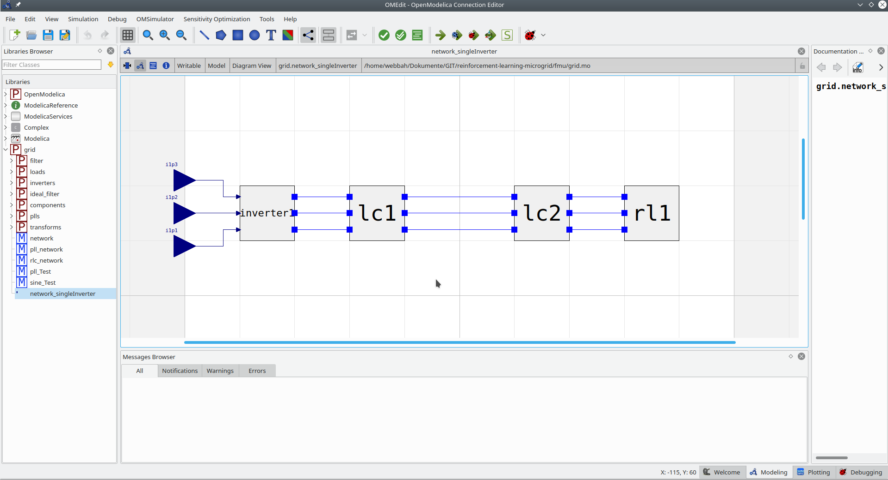
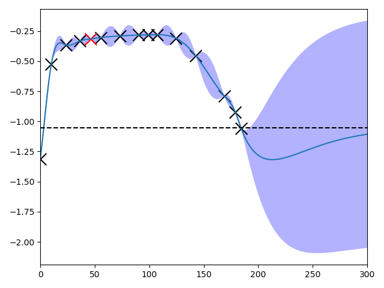

Examples
========

single\_inverter\_current\_control\_safe\_opt.py
^^^^^^^^^^^^^^^^^^^^^^^^^^^^^^^^^^^^^^^^^^^^^^^^

.. :file:: ../../../examples/single\_inverter\_current\_control\_safe\_opt.py

In this example a three phase inverter is supplying via a filter (lc1) a
load (rl1) like shown in the figure below. From that model a FMU is
built to create the environment.

An optimization methode developed by Berkenkamp et al.
(https://arxiv.org/abs/1509.01066) called Safe Controller Optimization -
safeopt - is used which takes a Gaussian process and Bayesian
optimization to safely determine "optimal" controller parameters. The
goal of the standard PI current controller is to supply a 15 A d-current
to the load.

The `generated FMU <fmu.html>`__ is used in the environment to build up
a gym env like the examples from OpenAI Gym (https://gym.openai.com/).
The gym enviroment is defined in (examples/berkenkamp.py, line 103). It
generates a gym environment using - reward function (line 51) - Plotting
the inductor values (current) from the lc1-filter (which should be
controlled) like shown in the figure below - Simulating 300 timesteps of
delta\_t of the FMU grid.network\_singleInverter.fmu (Generated from the
model in the plot abouve) - Using the setpoints for the inverters
(modulation indices) i1p{1,2,3} as inputs - and the inductor currents
and capactitor voltages of lc1-filter as ouptuts

.. figure:: ../pictures/i_abc_bk_kp15_Ki121.png
   :alt: 

The agent used in this simple RL-example is taken from the class
**SafeOptAgent**. It contains the controller a
**MultiPhaseDQCurrentSourcingController**, which consists of multiphase
(3) PI controllers to controll the current across the inductor of the
lc1-filter. There are also droop controllers implemented to calculate
e.g. the frequency drop due to load. The agent's task is to find better
parameters for the current controllers (Kp & Ki). Therefore they are
defined as mutable\_params (e.g.
examples/single\_inverter\_current\_control\_safe\_opt.py, line 126) to
adopt them between the episodes. The safeopt algorithm uses a Gaussian
process to estimate the performance of the controller. Therefore the
bounds (e.g. examples/single\_inverter\_current\_control\_safe\_opt.py,
line 97) and the lengthscale (eg.
examples/single\_inverter\_current\_control\_safe\_opt.py, line 98) for
the parameters (Kp and Ki) have to be defined.

One can adjust one of the parameters (Kp or Ki) (1D) or both of them
(2D) using the algorithm. Therefore the parameters in line 28-30 have to
be adjusted: - To adjust only Kp set **adjust\_Kp\_only** == True (and
all other parametes as False!) - To adjust only Ki set
**adjust\_Ki\_only** == True (and all other parametes as False!) - To
adjust only Kp and Ki set **adjust\_Kp\_and\_Ki** == True (and all other
parametes as False!)

Due to safeopt the agent need a safe starting point (Kp and Ki). Then it
tries to calculate safely parameters with better performance. The
performance is calculated using the reward function from the enviroment
defined in the function
(examples/single\_inverter\_current\_control\_safe\_opt.py, line 51).
There the MSE from the measured currents and the setpoints are
calculated. Additionally a barrier function is used to avoid
over-currents. The function can be adjusted using the parameter mu in
(examples/single\_inverter\_current\_control\_safe\_opt.py, line 44). In
case of an over-current the episode is aborted and a performance of the
abort\_reward-times (line 144) initial reward (negative) is given back.
The safe threshold for the agent is set as safe\_threshold-times less of
the inital performance. (agents/safeopt.py, line 85) E.g.
safe\_threshold = 1.2 and the inital reward is -10 the safe threshold
would be -12.

In the end of the script a **Runner** is used to execute 10 episodes
using the agent to control the enviroment. For every episode the
controlled currents and the performance function as a function of Kp
and/or Ki are plotted.

Some exemplary results are shown below:

-  If the parameter **adjust\_Kp\_only** is True, the agent tries to
   find an optimal value for the proportional gain (Kp) of the
   controller in the range of [0, 0.03] (bounds, line 87) with a
   lengthscale of 0.01 (line 88). In the figure below on the x-axis is
   the value for Kp and on the y-axis the performance value calculated
   using the reward function mentioned above.

.. figure:: ../pictures/kp_J.png
   :alt: 

-  If the parameter **adjust\_Ki\_only** is True, the agent tries to
   find an optimal value for the integral gain (Ki) of the controller in
   the range of [0, 300] (bounds, line 92) with a lengthscale of 50
   (line 93). In the figure below on the x-axis is the value for Ki and
   on the y-axis the performance value calculated using the reward
   function mentioned above.

The - due to the algorithm - "unsafe" point on the right (for Kp as well
as for Ki) is not due to overcurrent but due to bad performance due to
permanent control error. The resulting currents for Kp = 0.01 and Ki = 0
is shown in the picture below. Due to the high error compared to the
reference value (15 A d-current), the performance is as bad as the
algorithm deifnes it as unsafe - in comparison to the performance
reached using the intial controller parameters.

.. figure:: ../pictures/i_abc_ki_J_bad.png
   :alt: 

-  If the parameter **adjust\_Kp\_and\_Ki** is True, the agent tries to
   find an optimal value for the propotional gain (Kp) as well as for
   the integral gain (Ki) of the controller in the ranges of [0, 0.03]
   and a lengthscale of 0.01 for Kp and a range of [0, 300] and a
   lengthscale of 50 for Ki. In the figure below on the x-axis is the
   value for Kp, the y-axis the value for Ki and the z-axis the
   performance value calculated using the reward function.

.. figure:: ../pictures/kp_ki_J.png
   :alt: 

The results of the algorithm are printed into the console in the form
like below:

Iteration, performance J, Params [Kp, Ki]

::

           J                                      Params
    0  -0.527522                                [0.01, 10.0]
    1  -0.442648    [0.01517286546392185, 14.85163114970222]
    2  -0.318154    [0.01426989823624961, 44.96747682456248]
    3  -0.296940   [0.007935547159879385, 63.12800825929393]
    4  -0.286636    [0.01482713453607815, 88.70170996759624]
    5  -0.286815  [0.006770598304777539, 108.12303673537075]
    6  -0.280167  [0.013261084415467694, 135.24448051372738]
    7  -0.313204   [0.02201710533671064, 56.446583269542394]
    8  -1.387003  [0.022868977920736434, 108.40140778199653]
    9  -0.304403   [0.002145673177669012, 55.14569829606201]
    10 -0.480421   [0.026197353734745858, 22.29566509028389]
    11 -1.097157  [0.0055262530542335535, 157.4879776902759]
    12 -0.391706                    [0.0, 17.86728037560901]
    13 -1.307038                    [0.0, 106.0724160092763]
    14 -1.561142                    [0.03, 42.1020413015999]

The best performance in this short example of -0.280167 produces the
parameterset of Kp = 0.0132... and Ki = 135.244...

two_inverter_static_droop_control.py
^^^^^^^^^^^^^^^^^^^^^^^^^^^^^^^^^^^^

In this example, a FMU generated by OpenModelica as gym environment containing two inverters, each connected via an LC-filter to supply in parallel a rc load is used which is shown in the figure below.
This example uses the in auxiliaries available controllers. One inverter is set up as voltage forming inverter with a
direct droop controller which e.g. frequency drops due to the applied power. The other controller is used as current
sourcing inverter with an inverse droop controller which reacts on the frequency and voltage change due to its droop
control parameters by a power/reactive power change.
In the default setings, plots of the abc signal as well as the dq0 signals of
the master and slave are provided.

By default, the following small network will be simulated:

.. figure:: ../pictures/network.png
   :alt: 

A short introduction to experimental controller tuning with some hints
can be found `here <controller_tuning.html>`__.

If the controller works fine, a three phase voltage similar to the
following one should be one of the plots.

.. figure:: ../pictures/abc.png
   :alt: 

Any other demanded signal which is provided by the fmu or saved during
the simulating can be plotted by adding it to

::

    viz_cols=['*.m[dq0]', 'slave.freq', 'lcl1.*'],

in the gym.make() command. Make sure that demanded signal from the fmu
are listed as a model\_output:

::

    model_output={
                       'lc1': [
                           ['inductor1.i', 'inductor2.i', 'inductor3.i'],
                           ['capacitor1.v', 'capacitor2.v', 'capacitor3.v']],
                       'rl1': [f'inductor{i}.i' for i in range(1, 4)],
                       'lcl1':
                           [['inductor1.i', 'inductor2.i', 'inductor3.i'],
                            ['capacitor1.v', 'capacitor2.v', 'capacitor3.v']]},
                       )

Hint: Every possible variable which is provided by the fmu can be seen
the easiest in OpenModelica. Run the Simulation without input signals,
so every result for voltages and currents should be 0. On the bottom right side, you can select
each component of the model in the tree structure. Clicking through the
components until reaching the variable will show the whole variable name
(for example lcl2.inductor2.i) on top of the plotting window.

The parameters of the controller like the control frequency delta\_t,
the voltage, frequency or droop characteristics can be set directly in
the main function.
