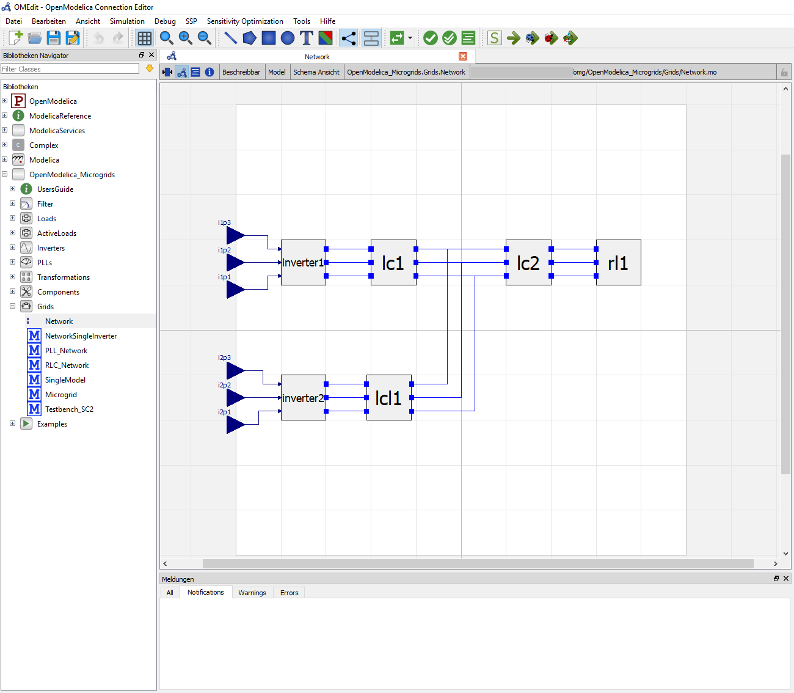
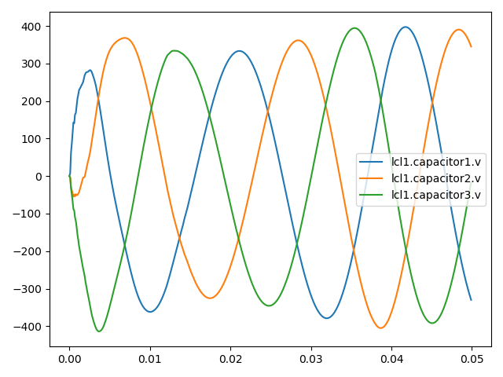

Getting Started
===============

.. figure:: ../../pictures/omg_flow.png
   :alt: 

This user guide covers all of OpenModelica Microgrids Gym (OMG) toolbox features by
topic area. Each of the following steps is introduced in a more detailed
way in the different chapters of this users guide.

First step is to `create the microgrid <OpenModelica.html>`__, which is
the environment for training reinforcement learning agents in power electronic-driven microgrids.
In addition, the OMG toolbox can be used for pure simulation and classical control purpose using OpenModelica models with a Python interface.

Each microgrid model is built in the open source software
`OpenModelica <https://www.openmodelica.org/>`__ and can be easily adapted.

For the transfer to Python, it needs to get exported as a `Functional
Mock-up Unit (FMU) <https://fmi-standard.org/>`__.

The creation process of the FMU is shown `here <fmu.html>`__. It is used to
build a gym environment like in the examples from `OpenAI
Gym <https://gym.openai.com/>`__. In OMG, the gym environment is defined
for example in (examples/two_inverter_static_droop_control.py).

After creating the environment, the network can be simulated in Python.
On the one hand, it is possible to test predefined, static controller designs
like described `here <examples.html#two-inverter-static-droop-control-py>`__.

However, the main function of this toolbox is to apply reinforcement learning
approaches by utilizing the OMG interface for optimal microgrid control as shown in this
`example <examples.html#single-inverter-current-control-safe-opt-py>`__.

.. figure::  ../../pictures/kp_kp_J.png
   :alt: 

Basic Examples
~~~~~~~~~~~~~~

To get an idea how the toolbox works and how to set-up an environment or an agent, two very basic examples are shown below. Both use the network presented above, but only the first inverter will be used.

Creating an environment
-----------------------

Following is a minimal example how to set-up an run an environment.
Necessary is the definition of model inputs, in this case the three phases of the first inverter.
The model outputs will be shown as simulation results, and the model path is the relative location of the FMU file, which contains the network.
For any other simulation parameters, for example the step-size, default values will be used.

For the initialisation, the environment needs to be reseted, and env.render will define the output plots.
The simulation will perform 1000 steps. A different random number will be provided to every of the three previously defined model_inputs.
Afterwards, the inductor currents of the LC-filter "lc1"shown in the figure above will be plotted, which should result in three increasing and due to the random function noisy  lines.

.. literalinclude:: ../../../examples/basic_env.py
   :linenos:

Creating an agent and a runner
------------------------------

Additionally to the environment, an an agent will be created and a runner will be used. The runner class will take care of initializing and termination
of agents and environments, as well as the execution of multiple episodes. The class will handle all information
exchange between agent and environment like presented in the high level code architecture shown below:

.. figure:: ../../pictures/highlevel.png
   :width: 400
   :alt:

Since the inputs are used for both the agent and the environment, they are defined in advance. Although the Agent gets information of the environment, in this small example, its action is still a random number.

The environment is the same as above. Afterwards, the agent and the runner get defined, and the runner runs for one episode.

.. literalinclude:: ../../../examples/simple_agent.py
   :linenos:

